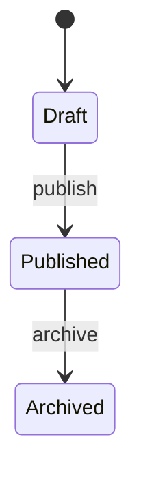

# Skill: 需求规格说明

将用户故事转化为详细的技术规格，包含 API 接口、数据模型、状态流转、前端页面规格等，是开发实施的核心依据。

## 前置条件

读取 `console/.claude/docs/{feature-name}/requirement.md`（必须）。

如果存在 `console/.claude/docs/{feature-name}/stories.md`，也一并读取。如不存在，可根据 requirement.md 直接生成规格说明（适用于小功能快速链路）。

## 执行步骤

1. 读取需求文档（requirement.md）和用户故事文档（stories.md，如存在）
2. 分析现有代码中相关的模块：
   - 后端 Controller:
     - Hub 模块: `console/backend/hub/src/main/java/com/iflytek/astron/console/hub/controller/`
     - Toolkit 模块: `console/backend/toolkit/src/main/java/com/iflytek/astron/console/toolkit/controller/`
   - 后端 Service:
     - Hub 模块: `console/backend/hub/src/main/java/com/iflytek/astron/console/hub/service/`
     - Toolkit 模块: `console/backend/toolkit/src/main/java/com/iflytek/astron/console/toolkit/service/`
   - 后端 Entity:
     - Hub 模块: `console/backend/hub/src/main/java/com/iflytek/astron/console/hub/entity/`
   - Commons 模块:
     - 工具类: `console/backend/commons/src/main/java/com/iflytek/astron/console/commons/util/`
     - DTO: `console/backend/commons/src/main/java/com/iflytek/astron/console/commons/dto/`
     - Service: `console/backend/commons/src/main/java/com/iflytek/astron/console/commons/service/`
   - 前端页面: `console/frontend/src/pages/`
   - 前端服务: `console/frontend/src/services/`
   - 前端 Store: `console/frontend/src/store/`
3. 设计 API 接口（遵循项目现有 RESTful 风格）
4. 设计数据模型变更
5. 描述前端页面规格
6. 生成 `spec.md`

## 输出文件

`console/.claude/docs/{feature-name}/spec.md`

## 输出模板

```markdown
---
feature: {功能名称}
created: {YYYY-MM-DD}
upstream: requirement.md (+ stories.md if exists)
---

# {功能名称} — 需求规格说明

## 1. 功能概述

{一段话总结功能的技术实现范围}

## 2. API 接口设计

### 2.1 {接口名称}

- **方法**: POST/GET/PUT/DELETE
- **路径**: `/{module}/{resource}`
- **权限**: @SpacePreAuth / @EnterprisePreAuth（角色要求）
- **描述**: {一句话}

**请求参数**:
```json
{
  "field1": "string, 必填, 描述",
  "field2": "number, 可选, 描述"
}
```

**响应格式**:
```json
{
  "code": 0,
  "message": "success",
  "data": {
    "field1": "string"
  }
}
```

**错误码**:
| code | message | 说明 |
|------|---------|------|
| 40001 | {错误信息} | {触发条件} |

### 2.2 {接口名称}

...（同上格式）

## 3. 数据模型

### 3.1 新增表

```sql
CREATE TABLE {table_name} (
    id BIGINT PRIMARY KEY AUTO_INCREMENT,
    -- 字段定义
    created_at DATETIME DEFAULT CURRENT_TIMESTAMP,
    updated_at DATETIME DEFAULT CURRENT_TIMESTAMP ON UPDATE CURRENT_TIMESTAMP
) COMMENT='{表说明}';
```

### 3.2 修改表

```sql
ALTER TABLE {table_name} ADD COLUMN {column} {type} COMMENT '{说明}';
```

### 3.3 Entity 映射

```java
@TableName("{table_name}")
public class {EntityName} {
    @TableId(type = IdType.ASSIGN_ID)
    private Long id;
    // 字段
}
```

## 4. 状态流转（如适用）

```
{状态A} --[事件]--> {状态B} --[事件]--> {状态C}
```

或使用 Mermaid:


## 5. 前端页面规格

### 5.1 页面路由

| 路由 | 组件 | 说明 |
|------|------|------|
| `/{path}` | `{ComponentName}` | {说明} |

### 5.2 页面交互流程

1. 用户进入页面 → 调用 `GET /api/...` 加载数据
2. 用户点击 {按钮} → 弹出 {Modal/Drawer}
3. 用户提交表单 → 调用 `POST /api/...`
4. 成功后 → {刷新列表/跳转/提示}

### 5.3 组件规格

| 组件 | 类型 | 数据源 | 交互 |
|------|------|--------|------|
| {组件名} | Table/Form/Modal | {API/Store} | {描述} |

## 6. 与现有代码的集成点

### 需要修改的现有文件
- `{文件路径}`: {修改内容}

### 可复用的现有代码
- `{文件路径}`: {可复用的函数/组件/工具类}
```

## 约束

- API 设计必须遵循项目现有风格（参考现有 Controller 的 URL 命名、参数风格）
- 数据模型必须兼容 MyBatis Plus 注解风格（@TableName, @TableField, @TableId）
- 前端组件必须使用 Ant Design 5 组件库
- 必须考虑多租户：请求头携带 `space-id` / `enterprise-id`
- 必须考虑国际化：所有用户可见文本使用 i18n key
- 必须列出可复用的现有代码，避免重复实现
- 中文为主，代码/SQL/JSON 保留英文
